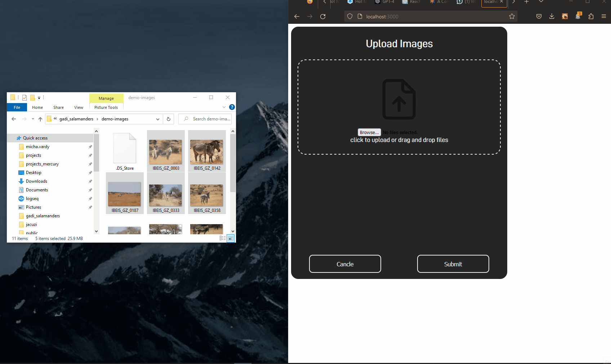

# Salamander Drop
### Drag and Drop Image Uploader



---
## whats missing (MVP)
**in no particular order**

**Priority listed in 1 to 5 stars after feature**

| task                                               | priority   | status | DEV |
| -------------------------------------------------- | ---------- | ------ | --- |
| login and oath                                     | \*         |        |     |
| image loading bar                                  | \*\*\*     |        |     |
| dataset form                                       | \*\*\*     |        |     |
| buttons for image manipulation                     | \*\*\*\*\* | Done   | MV  |
| image data can be changed and saved                | \*\*\*\*   |        |     |
| HTTP communication between front end and backend   | \*\*\*\*\* | Done   | MV  |
| image background removal feature                   | \*\*\*\*\* | WIP    | MV  |
| remove image background upon loading               | \*\*\*\*\* |        |     |
| add buttons for image manipulation features        | \*\*\*\*\* |        |     |
| image roate feature                                | \*\*\*\*\* |        |     |
| image glare removal feature                        | \*\*\*\*\* |        |     |
| image enlarge or reduce size                       | \*\*\*\*\* |        |     |
| image denied feature                               | \*\*\*\*\* |        |     |
| submit button for dataset                          | \*\*\*\*\* |        |     |
| saving dataset with images and metadata in mongoDB | \*\*\*\*\* |        |     |
| deploy on server                                   | \*\*\*\*\* |        |     |


---
## Purpose
The goal of Salamnder Drop is to provide an interface for salamander researchers to post, preprocess and store image data.
The Salamander image data will be passed through a IBEIS matching algorithem to find matches to other photographs of the same individual.


---
## Research Goals
once the images are stored, and matched, researchers want to answer questions regarding salamander quantity, movment patterns and how to prevent, 
salamanders from being run over by cars.

---
## Community science project

secondary goals of this project are to promote community science and research by gamifying the image capture and upload to provide the community, 
with an interface to contribute to the image database.

---

## Eventual workflow
Note: Currently only the researcher submission workflow is in active development as MVP

#### Researcher submission workflow
1. login
2. upload a set of images (could be thousands)
3. fill in dataset attributes form
    a. dataset name
    b. contributer name
    c. notes
4. Preprocess the images to prepare for matching
    a. remove all image backgorunds
    b. revolve so that the head is upword
    c. reduce any glare in the images
    d. mark images as denied if they contain more than one salamander
    e. fill in any missing meta data
        i. name 
        ii. gps
        iii. date / time
        iv. contributer
5. submit data to database
#### community individual contributer workflow: (not MVP)
1. login: likely through a phone app
2. upload an image: from their images
3. check stats 
    a. images uploaded
    b. high scores of community contributers
    c. salamanders named after them
4. will they preprocess the image?  will a researcher?

#### dashboards
1. heat map of salamander spottings that can be animated over time
2. salamander spotting predictions (based on the weather)
3. community high score

---

## Developer important notes
1. please work in seperate branch from master
2. please submit merge request to master
3. please add any useful cli commands to this readme document at the bottom

---
## Project Summery (developers)
- this application is a full stack application that will be pushed to production on a server.
- the app is hosted in github: http://github.com/michavardy/salamander_drop
- the app is built over docker compose with three containers
    - frontend container
    - backend container
    - mongo database container (will store all data)
- eventually a IBEIS container will be added to run the image matching algorthem
- the frontend is a react java script app
- the backend is a fastAPI python app
---
## Developer current practice (best?)
1. I develop locally inside my own environment
2. I start up a node server by going to 
    ```
        cd ./salamander_drop/frontend
        npm start
    ```
3. I start up a uvicorn server (backend)
    ```
        cd ./salamander_drop/backend/app
        uvicorn main:app --reload
    ```
4. if any additional packages are used they must be added to dockerfiles
---

## Commands to setup
```
docker-compose up           ## to start up docker-compose
docker-compose down         ## to take down docker-compose
```
# useful VS code extension for dockers
```
download Dev Containers Extension
ctrl+shift+p
Dev Containers: Attach to running container
```

# Commands for logs
```
docker logs <container-id>
```
