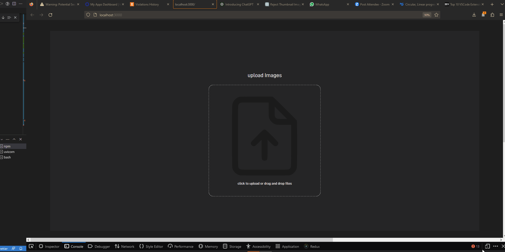

# Drag and Drop Image Uploader

## Goal

The goal of this project, is to practice full stack development, the first feature is a drag and drop image uploader


## Commands to setup
```
docker-compose up           ## to start up docker-compose
docker-compose down         ## to take down docker-compose
```
# Commands to develop
```
download Dev Containers Extension
ctrl+shift+p
Dev Containers: Attach to running container
Select: container name
frontend
```


